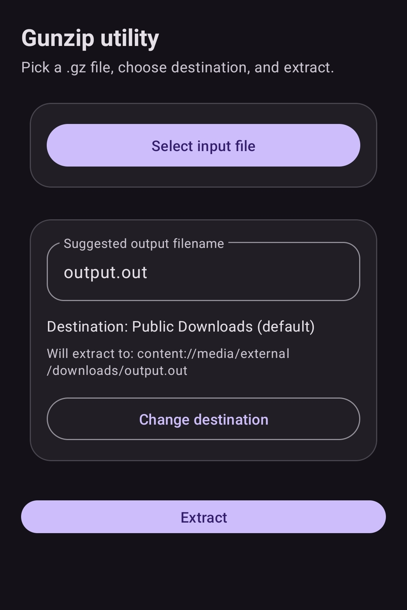

# Android Gunzip

Android Gunzip is a small Android app for extracting `.gz` files directly on-device.

## What it does

- Lets you pick an input gzip file using Android's document picker.
- Suggests and validates an output filename.
- Extracts either to the default Downloads location or to a custom folder.
- Handles common Android storage-permission edge cases with clear messages.

## Tech stack

- Kotlin + Android SDK
- Material 3 UI components
- `GZIPInputStream` for decompression

## Screenshot

